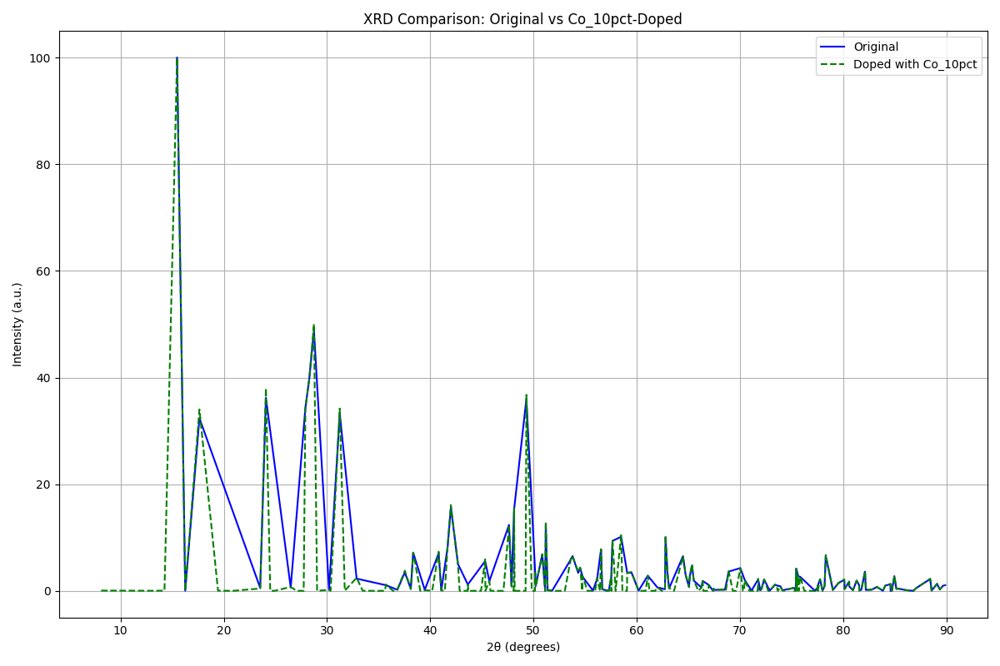

# XRD & Coordination – Crystallographic Curiosity

So, sooooo... I saw the same job opening I applied to last week get reposted two hours ago. And I sat there like Keanu Reeves on that bench, existential, still, maybe a little betrayed by the algorithm. But inside my head, the Dignam in me started pacing, muttering **"maybe..."**, like it was about to turn into a full interrogation scene.

The job? Crystallography. Diffraction. Atomic coordination. My kind of playground. I'd already built something, sure, but this time I wasn't just revisiting. I was going full Sherlock. Not the charming chaos of Tony Stark, I mean, I respect the guy, but I prefer my genius with a British accent and a violin. Cumberbotch, no wait, Cumbersnatch, no wait, Cumberbatch mode activated.

I dove back in. CIF files, diffraction patterns, coordination shells. I didn't just analyze, I interrogated. I swapped atoms like suspects in a lineup. I tracked density shifts like footprints in fresh snow. I let the lattice speak, and I listened like it was whispering secrets only a detective could decode.

This wasn't just a follow-up. It was a crystallographic investigation.

---

## What This Project Explores

- Loads a CIF file from the [Crystallography Open Database](https://www.crystallography.net/cod/1000227.html)
- Simulates X-ray diffraction (XRD) patterns using `pymatgen`'s `XRDCalculator`
- Performs theoretical density calculations based on unit cell volume and formula weight
- Analyzes atomic coordination environments using `CrystalNN`
- Simulates doping by substituting Mn atoms with Co or Zn at varying fractions
- Compares XRD patterns before and after doping
- Exports doped structures in CIF, JSON, and POSCAR formats
- Summarizes results in CSV and JSON for downstream analysis

---

## Key Files

- `simulate_doping.py` – main script for structure loading, doping, analysis, and export
- `1000227.cif` – crystallographic input file for MnFeF₅·2H₂O
- `exports/` – folder containing:
  - Doped structure files (`doped_Co_10pct.cif`, etc.)
  - XRD comparison plots (`xrd_comparison_Co_10pct.png`, etc.)
  - Summary tables (`doping_summary.csv`, `doping_summary.json`)

---

## Data Source

This project uses crystallographic data from:

**Crystallography Open Database (COD)**  
Entry: [1000227](https://www.crystallography.net/cod/1000227.html)  
Compound: Manganese iron pentafluoride bis(hydrate)  
Formula: F₅FeH₄MnO₂  
Space Group: Imma (No. 74)  
Licensed under **CC0 1.0 Universal**, free for research and analysis

---

## Results Summary (The Pizza Topping Edition)

Imagine your crystal structure is a pizza with 4 slices, and each slice has a topping: let's say **pepperoni** (Mn). You want to experiment by swapping out some pepperoni for **olives (Co)** or **pineapple (Zn)**. But here's the twist: you only have 4 slices total, so even a small change, like 5%, means replacing **1 whole slice**. That's 25% of your pizza!

### Topping Impact

- Swapping in **olives (Co)** made the pizza just a little heavier.
  - Density went from **2.8937** to **2.9056 g/cm³**
- Swapping in **pineapple (Zn)** made it even heavier.
  - Density rose to **2.9250 g/cm³**

### Flavor Pairings (Coordination)

Think of each topping surrounded by other ingredients, like cheese, sauce, and crust. When you add olives or pineapple, they pair up with **fluorine (F⁻)** and **oxygen (O²⁻)**, forming a tasty little cluster (like an octahedral flavor burst).

> Note: The recipe book (CrystalNN) gave a warning, it couldn't find the seasoning levels (oxidation states). So the flavor profile might be a bit off unless you add that info.

### Portion Reality

- You tried 5%, 10%, and 20% topping swaps.
- But with only 4 slices, each attempt still just swapped **1 slice**.
- So all your pizzas ended up with **3 pepperoni + 1 olive or pineapple**, no matter the percentage.

### Sample Pizza Comparison Chart



This chart is like a taste test. It shows how the original pizza and the modified one reflect flavor differently (via X-ray diffraction). The peaks and dips? That's the oven reacting to the new topping. Even one swapped slice changes the whole vibe.

---

## Oxidation State Handling

This project uses `pymatgen` for coordination analysis and structure manipulation. To ensure accurate results, oxidation states are assigned using:

```python
structure.add_oxidation_state_by_guess()
```

This step improves the reliability of coordination environments by allowing `CrystalNN` to use ionic radii instead of default covalent or atomic values.

> **Note:** If oxidation states are not set, `pymatgen` may issue warnings and fall back to less accurate radius estimates, potentially affecting coordination results.

---

## Requirements

- Python 3.8+
- `pymatgen`, `matplotlib`, `pathlib`
- Optional: `pandas` for extended data handling

Install dependencies with:

```bash
pip install pymatgen matplotlib
```

---

## Why It Exists

This project was born out of a moment of existential job-searching angst and crystallographic obsession. It exists to turn passive data into active insight, to transform CIF files into stories of atomic intrigue. It's a sandbox for structural sleuthing, a place where coordination environments aren't just calculated, they're interrogated.

---

## What's Next?

- **Oxidation State Refinement**: Incorporate known oxidation states from literature or assign manually for more accurate coordination analysis.
- **Partial Occupancy Modeling**: Move beyond whole-slice substitutions to simulate true fractional doping using supercells or statistical methods.
- **Machine Learning Integration**: Use clustering or dimensionality reduction to classify coordination environments and predict structural changes.
- **Interactive Dashboard**: Build a Streamlit or Dash app to visualize XRD shifts, coordination shells and density changes dynamically.
- **Experimental Validation**: Compare simulated XRD patterns with actual lab data to ground the model in reality.
- **More Dopants, More Drama**: Try swapping in other elements, Ni, Cu, even rare earths, and see how the lattice reacts.

And maybe, just maybe, this project becomes the portfolio piece that makes the algorithm blink twice and say: "Wait... we need this person."
