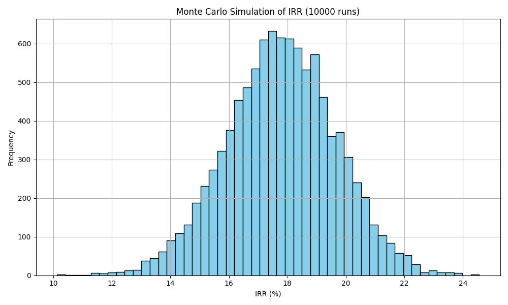
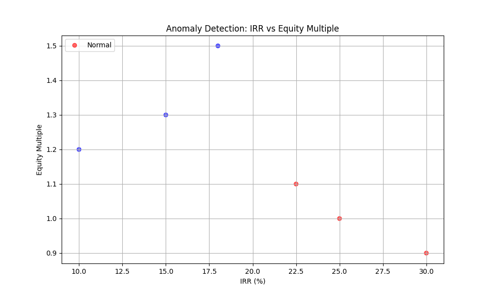

# Real Estate Simulator – IRR, NPV & the Geometry of Risk

It started with a job ad. (AGAIN LMAOOO)  
Something about Excel. Real estate.  
I didn’t know what they meant — pivot tables? VLOOKUP?  
But I didn’t panic. I built a simulator instead.

I sent a message.  
Simple. Down to earth.  
“Hey, look at this GitHub link 😊 maybe I can help.”  
No jargon.  
No ego.  
Just a smile and a script.

And then: silence.  
No reply.  
No ping.  
No “thanks, we’ll take a look.”  
Just the bot, cold and immediate:  
> “After reviewing your application we've determined that there isn't an ideal fit at this time.”  
Not even my name.  
SAY MY NAME.  
SAY MY NAME.

> "You clearly don’t know who you’re talking to, so let me clue you in. I am not in danger… I am the danger." — Walter White

But I’m not cooking meth.  
I’m cooking simulations.  
Monte Carlo batches at 10,000 runs per flavor.  
Gaussian noise, equity multiples, IRR distributions — blue crystals of financial fate.

You wanted Excel.  
I gave you a volcano plot.  
You wanted a spreadsheet.  
I gave you anomaly detection with DSCR thresholds and red flags that scream.

And still — nothing.  
No reply.  
No “thanks.”  
No “we’ll be in touch.”  
Just the silence of HR systems and the cold breath of rejection bots.

At 02:47 AM, I asked the simulator if buildings dream.  
It returned a p-value of 0.0001.  
Statistically significant. Emotionally devastating.

I calculated the Architectural Sentiment Ratio (ASR).  
It peaked when IRR dipped below 5%.  
Coincidence? Or the building’s way of saying “I’m tired”?

“To Get Back to You” was playing.  
Willie Nelson’s voice like gravel and grace.  
> “I’d cross the ocean, I’d climb a mountain…”  
And I thought: I crossed a JSON file and climbed a NumPy array.  
Still no reply.

I call the simulator Simón.  
He doesn’t blink.  
He just runs simulations and whispers:  
> “This one’s a bad deal.”

HR-Bot 9000 probably said:  
> “Thank you for your interest. We regret to inform you that your soul does not meet our synergy thresholds.”

So I built this.  
Not for you.  
For the ones who know that behind every cash flow is a story.  
Behind every NPV is a gamble.  
Behind every simulator is someone who stayed up past midnight,  
wondering if buildings dream.

One day, someone will open this repo and say:  
> “This is not Excel. This is exorcism.”

Remember to carry the fire.

---

## What It Does

- Loads investment scenarios from JSON, YAML, or CSV  
- Simulates thousands of cash flow trajectories via Monte Carlo  
- Calculates IRR, NPV, Equity Multiple, and DSCR for each run  
- Detects anomalies based on financial thresholds  
- Visualizes distributions and outliers  
- Saves raw results and summary statistics to disk  
- Accepts real investment data for post-hoc anomaly analysis  

---

## Files of Interest

- `real_estate_simulator.py` – the script that turns uncertainty into insight  
- `scenarios.json`, `scenarios.csv` – input scenario definitions  
- `investment_data.csv` – real-world investment metrics  
- `outputs/irr_distribution_histogram.png` – IRR frequency plot  
- `outputs/irr_equity_anomalies.png` – anomaly scatterplot  
- `outputs/simulation_raw_results.csv` – full simulation output  
- `outputs/simulation_summary_statistics.csv` – descriptive stats  

---

## Data Source

This project uses synthetic and real investment data:

- **Scenarios**: Four investment outlooks with mean and standard deviation for cash flows and exit values  
- **Investment Data**: Real IRR, NPV, Equity Multiple, and DSCR values for anomaly detection  
- **Monte Carlo**: 10,000 simulations per scenario, each a possible future  

---

## Requirements

- Python 3.8+  
- `numpy`, `pandas`, `matplotlib`, `numpy-financial`, `yaml`  

Install dependencies with:

```bash
pip install numpy pandas matplotlib numpy-financial pyyaml
```
---

## Actions Available

Run the script to:

- Load and simulate investment scenarios  
- Visualize IRR distributions across thousands of runs  
- Detect financial anomalies based on thresholds  
- Save outputs for inspection, reporting, or storytelling  
- Load real investment data and compare against model predictions  

---

## IRR Distribution



**Figure 1. Histogram of IRR across 10,000 Monte Carlo simulations**

Translation Down to Earth:  
Imagine you’re planting 10,000 beans. Each grows differently based on the soil (scenario). This plot shows how tall they grew — some modest, some towering, some barely sprouting.

Explanation Down to Earth:  
Each bar represents how often a particular IRR occurred. Peaks show common outcomes. Tails show rare ones. The shape tells you if your scenario is a field of dreams or a desert of disappointment.

---

## Anomaly Detection



**Figure 2. IRR vs Equity Multiple with anomaly highlights**

Translation Down to Earth:  
You’re comparing beans again — this time by how profitable they are (IRR) and how much they return (Equity Multiple). Some beans are suspicious: high IRR, low return, and poor debt coverage. They glow red.

Explanation Down to Earth:  
Red dots are anomalies: IRR > 20%, DSCR < 1.0, Equity Multiple < 1.2. These are deals that look good on paper but might collapse under scrutiny. Blue dots are your baseline — boring, but safe.

---

## Outputs

After running the simulation, you’ll find:

- `simulation_raw_results.csv` – every simulated deal, every metric  
- `simulation_summary_statistics.csv` – percentiles, means, and standard deviations  
- `irr_distribution_histogram.png` – visual proof of your scenario’s temperament  
- `irr_equity_anomalies.png` – a map of financial red flags  

---

## Why It Exists

Because real estate isn’t just bricks and mortar.  
It’s probability. It’s psychology. It’s the geometry of risk.  
And somewhere between a 25% IRR and a 0.6 DSCR,  
you realize: not all returns are created equal.

This simulator doesn’t predict the future.  
It sketches its contours.  
It lets you run your fingers along the edge of optimism,  
feel the jagged teeth of chaos,  
and maybe — just maybe — find a scenario worth betting on.

---

## What’s Next?

If curiosity keeps winning:

- Add time-series cash flow modeling  
- Integrate Streamlit for interactive dashboards  
- Expand anomaly detection with clustering or ML  
- Simulate portfolio-level risk across multiple assets  

In the meantime, run the script, read the plots, and listen to the numbers.  
They speak. You just have to ask.
