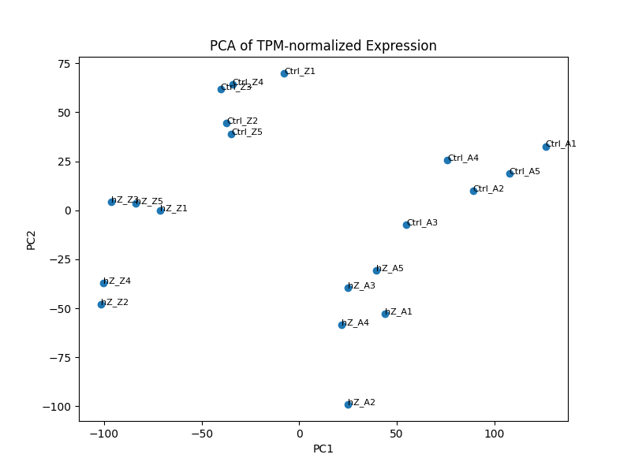
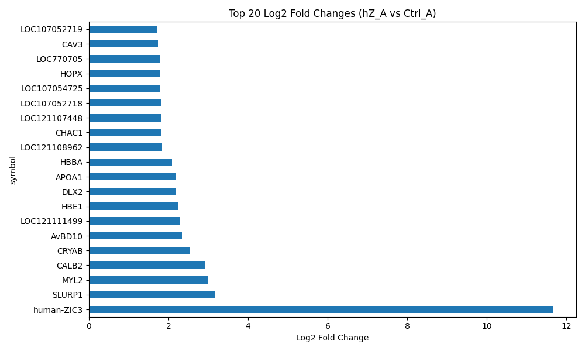
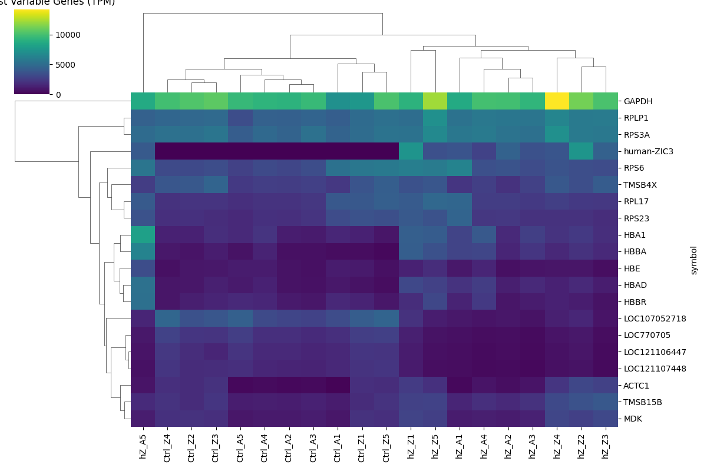
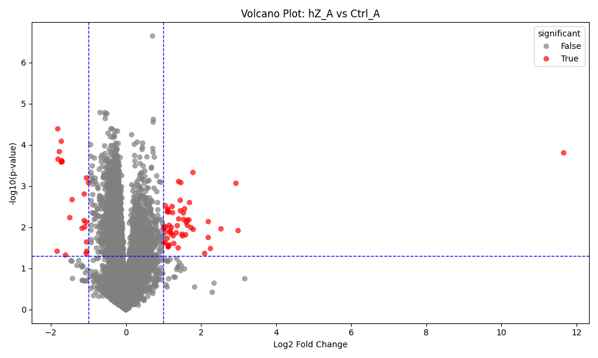

# TPM & Transcript – GSE266376 Geometry

So I ran another script. Again, for a job. A French one this time, bioinformatics with an agricultural twist. Still not entirely sure what it was about, but it had something to do with Hi-C, specifically *hicream*, and this sentence stuck with me:  
**"L'objectif est d'appliquer la méthode hicream à des données de génomique 3D issues d'espèces d'élevage afin de produire des résultats originaux sur les mécanismes de régulation fonctionnelle."**  
Voilà. That was enough to spark curiosity. It was already 22:00 (aka 10 PM), and I'm a Python aficionado. So, naturally, I dove in.

As usual, the first question: *Where the f. can I get some data?*  
I started poking around and ended up on **ncbi.nlm.nih.gov**, which, after a few clicks, felt like discovering a secret library. And then: *Gallus.*  
Let's sacrifice a Gallus to Esculapio, I thought. That name rings familiar, especially if you've studied philosophy. And that's when I stumbled upon **GSE266376**, a public dataset profiling mRNA expression in chicken limbs overexpressing human Zic3.  
I downloaded it from [NCBI GEO](https://www.ncbi.nlm.nih.gov/geo/browse/?view=series&tax=9031), where Bai Shibin and the squad offered a glimpse into developmental orchestration.

Somewhere between the limbs of Gallus and the folds of Zic3 expression, I started seeing rooms.  
Not literal ones, but fragments, like Perec's puzzle:  
*« Chaque pièce est un fragment du monde, un éclat de mémoire, une énigme à recomposer. »*  
This wasn't just bioinformatics. It was architecture. Of meaning. Of madness.

---

## What It Does

- Loads raw and TPM-normalized count data from GSE266376  
- Filters low-expression genes to reduce noise  
- Performs PCA and hierarchical clustering for exploratory insight  
- Calculates log2 fold changes and performs Welch's t-tests  
- Generates volcano plots and top fold-change visualizations  
- Annotates top genes using MyGene.info (Gallus gallus, species 9031)  
- Outputs structured CSV and PNG files for inspection or archival  
- Designed to be modular, readable, and extendable for future datasets  

---

## Files of Interest

- `rna_seq_pipeline.py` – the script that started with a TPM and ended with a transcriptomic profile  
- `GSE266376_Raw_counts.txt.gz`, `GSE266376_TPM_Normalized_counts.txt.gz` – input data files  
- `top_20_variable_genes_heatmap.png`, `pca_plot.png` – EDA visualizations  
- `top_20_log2_fc.png`, `volcano_plot.png` – differential expression plots  
- `t-test_results.csv` – statistical summary of gene-level comparisons  
- `results/figures/`, `results/t-test_results.csv` – output directory  

---

## Data Source

This project uses data from:

**GSE266376 – Expression profiling by high throughput sequencing**  
- mRNA-Seq data of human-Zic3 overexpression in chicken limbs  
- Organism: *Gallus gallus*  
- Contributor: Bai Shibin  
- Published: August 27, 2025  
- Available at: [NCBI GEO – Gallus gallus Series](https://www.ncbi.nlm.nih.gov/geo/browse/?view=series&tax=9031)

---

## Requirements

- Python 3.8+  
- `numpy`, `pandas`, `matplotlib`, `seaborn`, `scipy`, `scikit-learn`  
- Optional: `mygene` for gene annotation  

Install dependencies with:

```bash
pip install numpy pandas matplotlib seaborn scipy scikit-learn mygene
```

## Actions Available

Run the script to:

- Filter and preprocess RNA-seq data  
- Perform PCA and clustering on TPM-normalized counts  
- Analyze differential expression between hZ_A and Ctrl_A samples  
- Generate volcano plots and fold-change summaries  
- Annotate top genes with biological context  

---

## Gene Beans: A Down-to-Earth Guide to Expression Analysis

### PCA Plot



**Figure 1. Principal Component Analysis (PCA) of TPM-normalized gene expression**

Translation Down to Earth: Imagine you're tasting 100 types of beans from different farms. Each bean has dozens of flavor notes, earthy, nutty, sweet, bitter. PCA is like reducing all those flavor notes into just two main taste dimensions: maybe "sweetness" and "earthiness." Then you plot each bean on a map based on those two traits.

Explanation Down to Earth: In your PCA plot, each dot is a sample (like a bean), and the axes represent the most important differences in gene expression. If hZ_A beans cluster on one side and Ctrl_A beans on the other, it means they have distinct "flavor profiles", aka biological signatures.

---

### Top 20 Log2 Fold Changes



**Figure 2. Top 20 genes with highest absolute log2 fold change between hZ_A and Ctrl_A**  

Translation Down to Earth: You're comparing bean prices between two markets: hZ_A and Ctrl_A. A log2 fold change is like saying, "This bean is 8 times more expensive in hZ_A than Ctrl_A."

Explanation Down to Earth: Your bar plot shows which genes are most differently expressed between the two conditions. A gene like human-ZIC3 being 11.66 log2FC is like saying it's crazy expensive in hZ_A compared to Ctrl_A, possibly a key ingredient in that market's recipe.

---

### Top 20 Variable Genes Heatmap



**Figure 3. Hierarchical clustering of the top 20 most variable genes across all samples**  

Translation Down to Earth: You're comparing how 20 types of beans cook across different kitchens. Some beans take longer in one kitchen, others cook faster. You color-code the cooking time and cluster similar beans and kitchens together.

Explanation Down to Earth: Your heatmap shows how the top 20 most variable genes behave across samples. If certain genes (beans) behave similarly across samples (kitchens), they cluster together. It helps you spot patterns, like which genes are consistently "slow cookers" or "quick boil."

---

### Volcano Plot



**Figure 4. Volcano plot of differential gene expression between hZ_A and Ctrl_A**  

Translation Down to Earth: You're plotting beans based on how popular they are (statistical significance) and how much their price differs between markets (fold change). Beans that are both very popular and very differently priced stand out.

Explanation Down to Earth: Your volcano plot shows which genes are both statistically significant and biologically meaningful. Red dots are the beans that everyone's talking about, they're different enough and important enough to matter.

---

## Gene Beans: A Tragicomic Tale

The data was clear. The beans were expressive.  
*And Mendel runs away crying.*

---

## Why It Exists

Because somewhere between the folds of TPM matrices and the silence of raw counts, I found myself coding at 22:00, the screen glowing like a projector in an empty theater.  
Radiohead's *Let Down* looping in the background, melancholy, mechanical, strangely alive.  
Debussy's *Clair de Lune* followed, like moonlight on a spreadsheet.  
And suddenly, the script wasn't just code. It was choreography.

TPMs aren't just normalized counts.  
They're fingerprints of fate.  
Fold changes aren't just ratios.  
They're echoes, of regulation, of resistance, of limbs learning to grow under the influence of a foreign gene.

Who are you? I'm Strider.

To analyze a transcriptome is to ask:  
What does this gene weigh in the world of development?
Is it transport, motorways and tramlines, or something quieter, an echo of embryonic choreography?
What does it sound like when overexpressed?
Does it hum like a chemical reaction, or collapse like a bug in the ground?
What secrets does its p-value whisper when the loop hits its fourth repeat?

Is it signal or noise, or something in between, one day, I'm gonna grow wings, it says, and maybe that's the phenotype we're chasing. Not certainty, but flight.

Is there a way to predict form from fold change, even if not perfectly aligned?
What's the architecture Avicenna spoke of, the hidden grammar beneath the flesh, the necessary cause behind the apparent effect?

To analyze a transcriptome is to listen. Not just to numbers, but to longing. To the way a volcano plot doesn't just erupt, it invites. A place to throw the ring. To let go of control. To let down.

---

## What's Next?

If curiosity keeps winning:

- Extend to time-series or multi-condition comparisons  
- Visualize gene expression dynamics in a Streamlit dashboard  
- Export annotated results to CSV for downstream analysis  
- Explore clustering and enrichment across the entire transcriptome  

In the meantime, run the script, admire the volcano, and maybe annotate a few genes.
