# NYC Yellow Taxi Trip Analysis

-

---

**What It Does:**

- Compares key metrics such as trip distance, fare amounts, and tip behavior between 2019 and 2025  
- Analyzes hourly travel patterns and average trip durations by weekday across both years  
- Detects and contrasts anomalous trip patterns, including speed, duration, and pricing irregularities  
- Breaks down reasons for suspicious trips with detailed proportions by anomaly type  
- Highlights NYC zones with the highest concentrations of flagged trips and shifts over time  
- Visualizes pickup zone trends and identifies hotspots with rising anomaly rates  
- Incorporates machine learning insights using Isolation Forest and Logistic Regression models for anomaly detection  
- Summarizes changes in payment behavior, tip averages, and urban transit dynamics across time  

---

**Files of Interest:**

- `compare_anomalies.py` – It loads the data, calls functions from the other modules to clean and process the data, performs the anomaly detection, and generates the comparison plots.
- `anomaly_detection.py` – It includes functions for rule-based anomaly detection, machine learning models, and a simple classification model.
- `visualization.py` – It contains the code to generate and save the various plots and graphs.
- `output_anomaly_comparison/` – Directory containing the generated plots and summaries.

---

**Data Source:**

Trip data from the [NYC Taxi & Limousine Commission](https://www.nyc.gov/site/tlc/about/tlc-trip-record-data.page).
- **Yellow Taxi Trip Records – January 2019 (PARQUET)**
- **Yellow Taxi Trip Records – January 2025 (PARQUET)**
- **Taxi Zone Lookup Table (CSV)**

---

### Trip Distance Distribution  
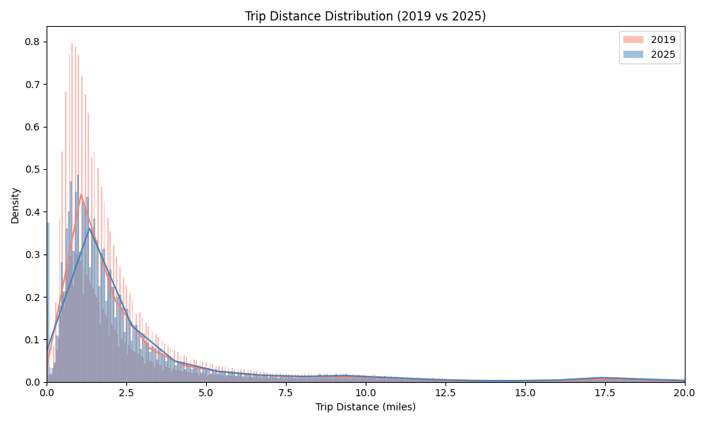  
*Compares the distribution of trip distances in 2019 and 2025.*

### Hourly Trip Counts  
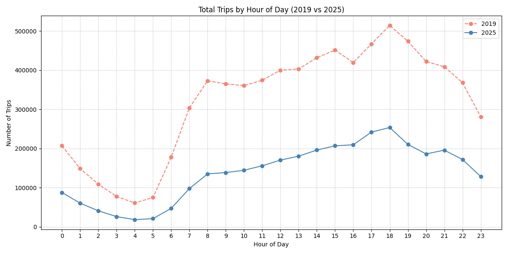  
*Displays the number of trips taken each hour of the day for both 2019 and 2025.*

### Avg Trip Duration by Weekday  
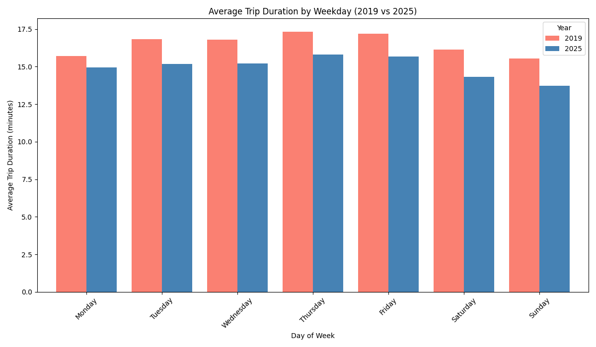  
*Bar chart comparing the average trip duration on each day of the week for both years.*

---

### Total Anomaly Trend  
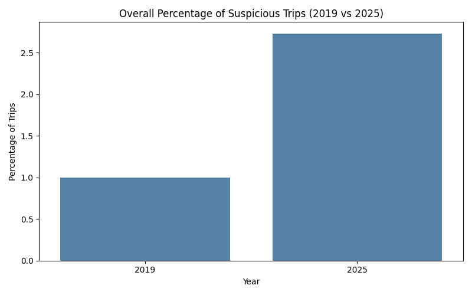  
*Compares the overall percentage of suspicious trips between 2019 and 2025.*

### Suspicious Trip Breakdown  
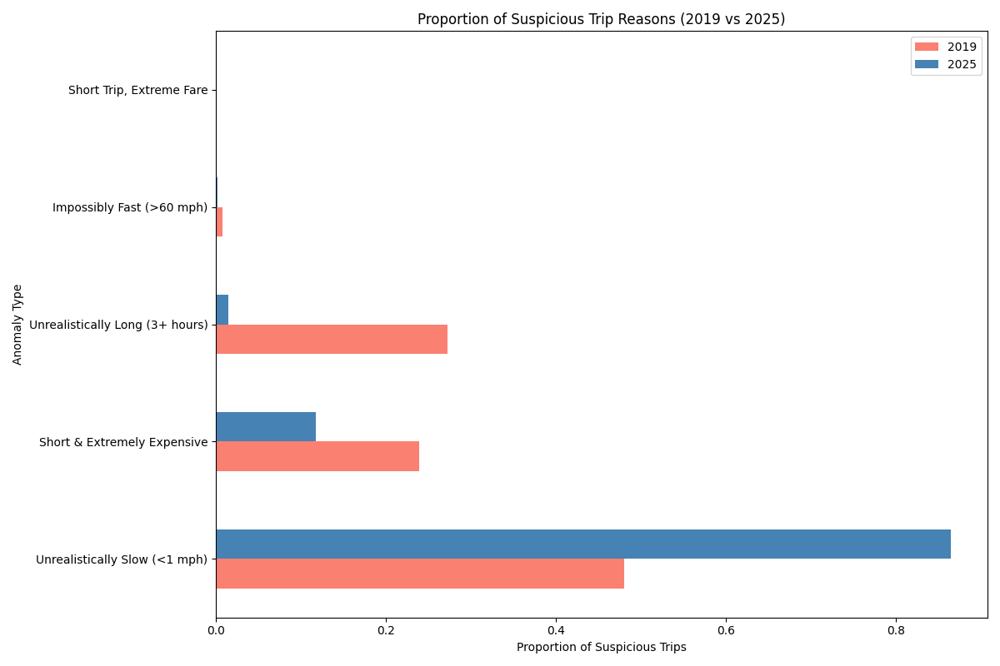  
*Breakdown of reasons for flagged trips across both years.*

### Suspicious Fare Distribution  
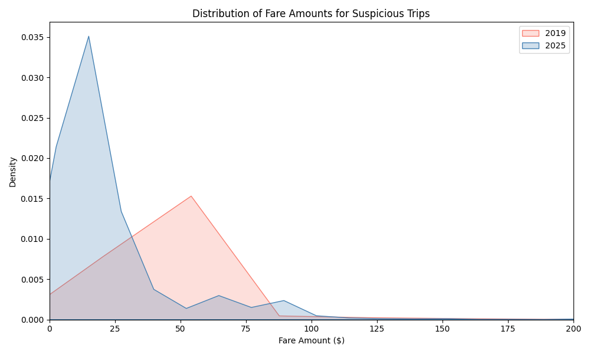  
*Fare amounts for trips that were flagged as suspicious.*

### Suspicious Speed Distribution  
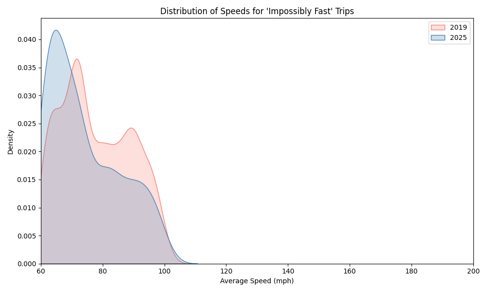  
*Speed distribution for "impossibly fast" trips.*

### Suspicious Time Heatmap (2019)  
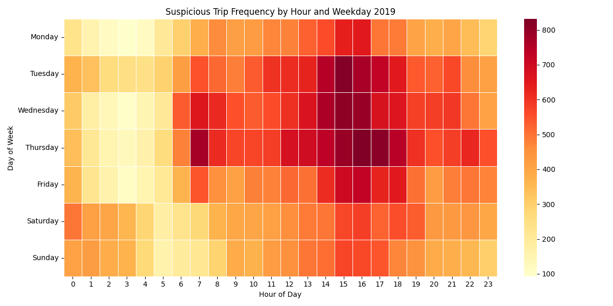  
*Hourly and weekday pattern of suspicious trips in 2019.*

### Suspicious Time Heatmap (2025)  
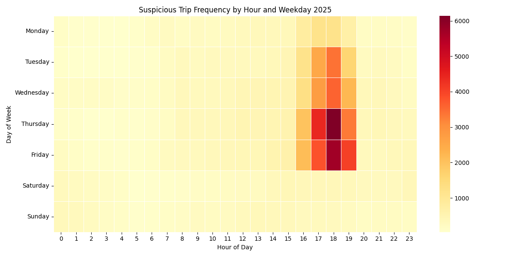  
*Hourly and weekday pattern of suspicious trips in 2025.*

---

### Top Suspicious Zones (2019)  
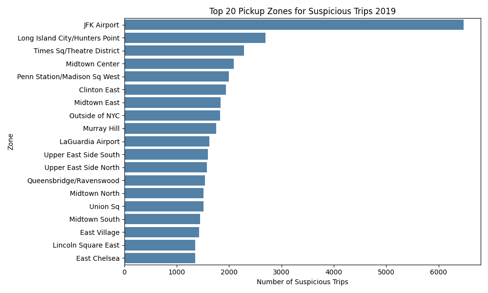  
*Top 20 pickup zones with the most flagged trips in 2019.*

### Top Suspicious Zones (2025)  
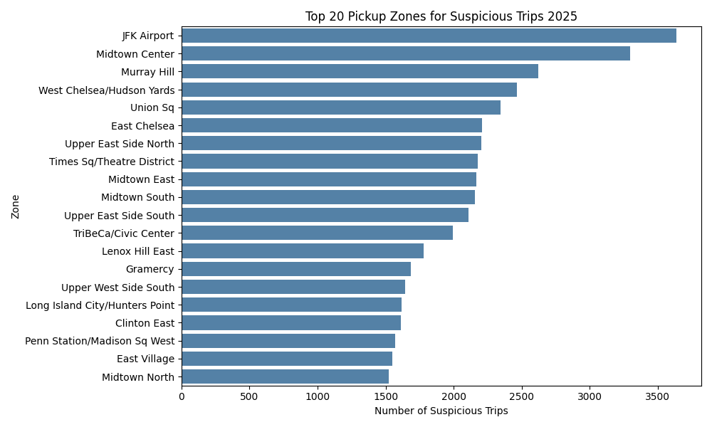  
*Top suspicious pickup zones in 2025.*

---

### Prediction Confidence Histogram (2019)  
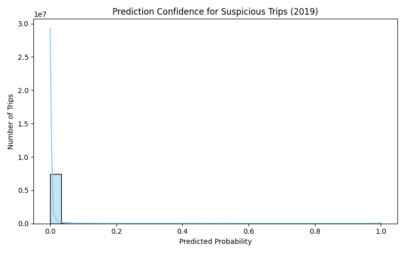  
*Histogram of the logistic regression model’s confidence for 2019.*

### Prediction Confidence Histogram (2025)  
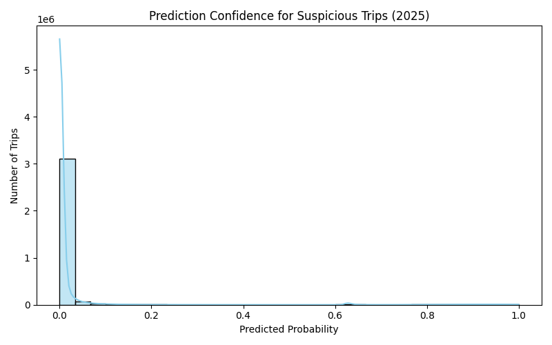  
*Model confidence histogram for 2025 predictions.*

### Label Distribution Bar Chart (2019)  
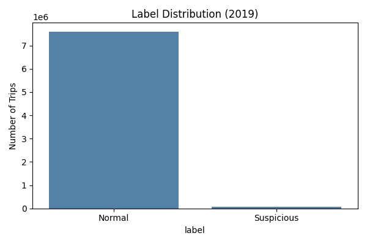  
*Count of “Normal” vs “Suspicious” trips in 2019.*

### Label Distribution Bar Chart (2025)  
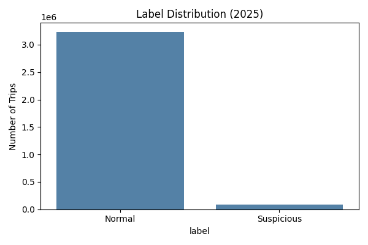  
*Comparison of labeled trips in 2025.*

---

## Why It Exists

?

---

## What's Next?

?
