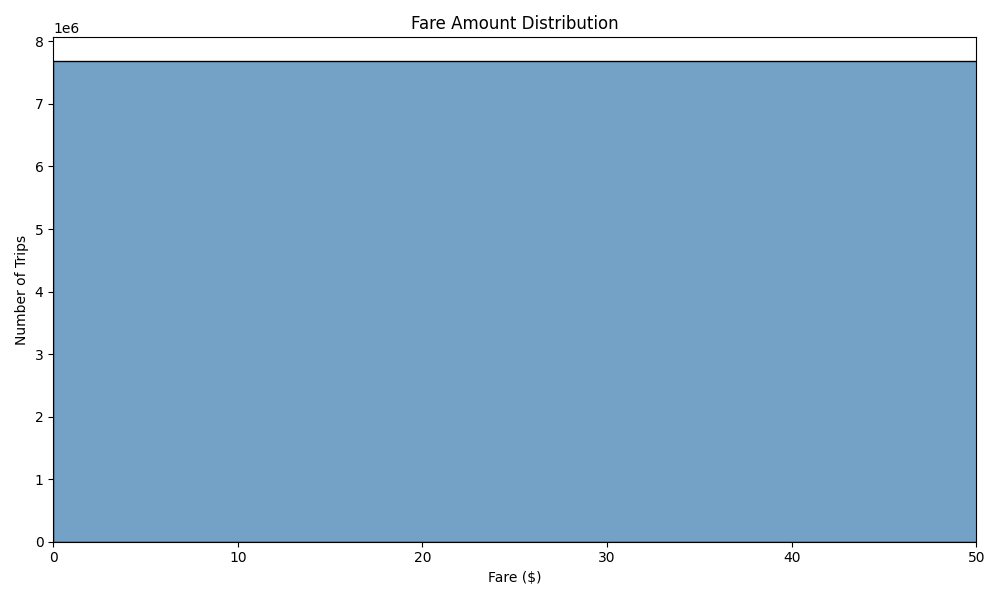
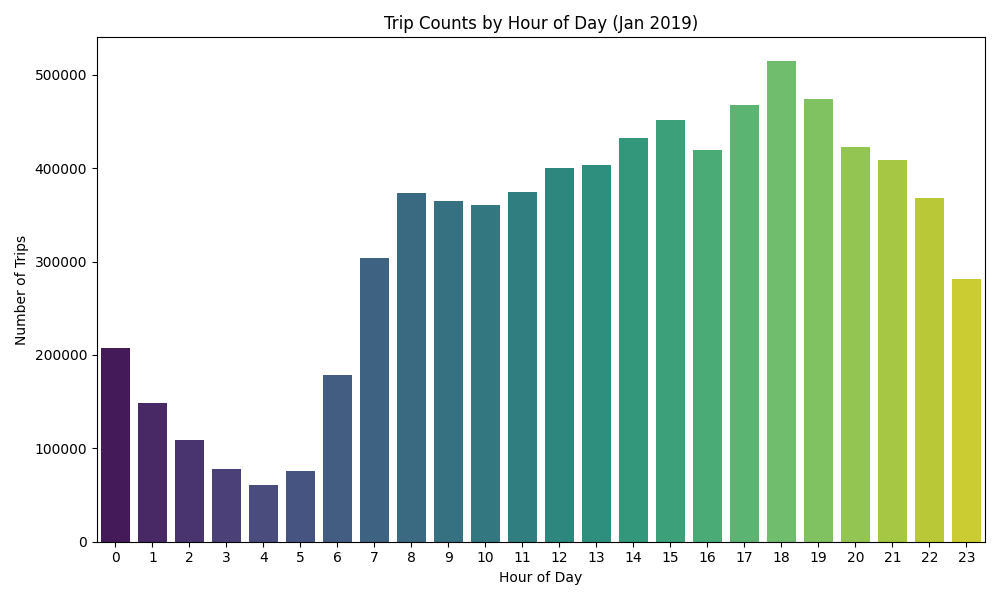
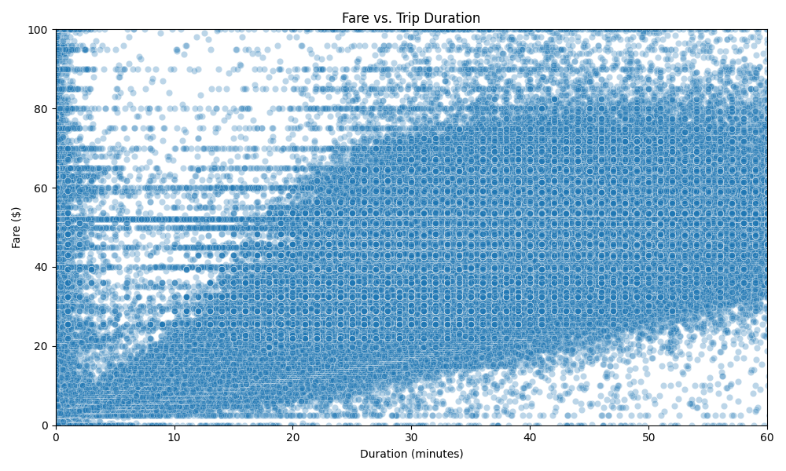
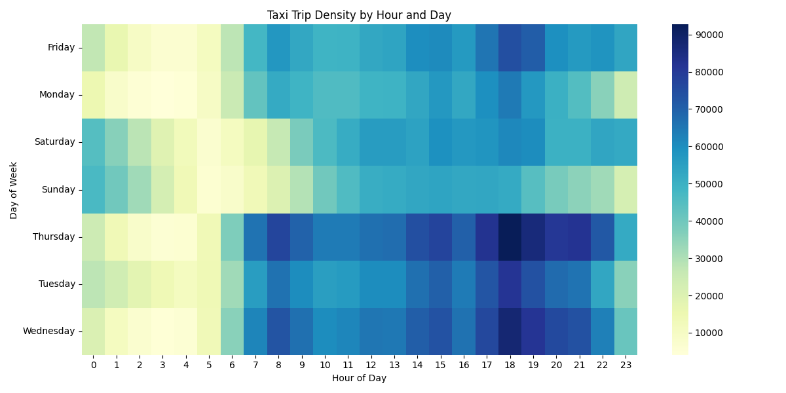
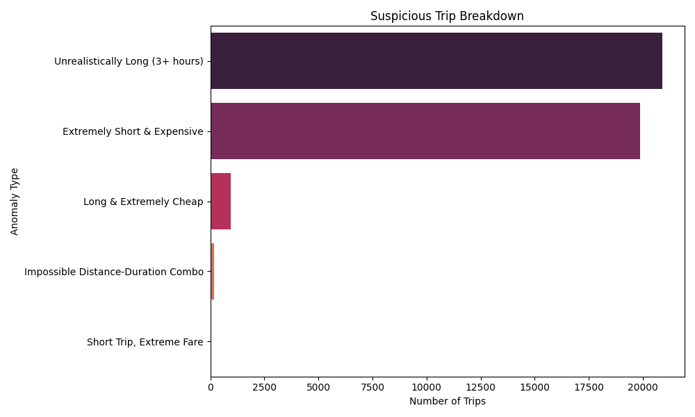
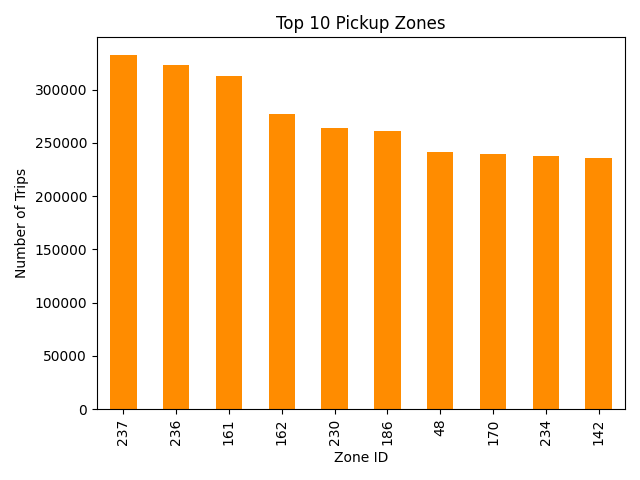

# NYC Yellow Taxi Trip Analysis

It started with a job application - one that came from Kuta, Badung Regency, Indonesia. A place known for its surf breaks and shadow puppetry, where the scent of clove cigarettes mingles with the sea breeze and the echoes of gamelan music drift through the streets. The question was simple, but not ordinary:

> "Describe the largest dataset you have worked with - include the approximate size (rows, records, or file size), the tools you used to process it, and the type of analysis or outcome you delivered. For that specific project, which stakeholders did you work with, and how did your findings impact their decisions?"

I could've answered with bullet points. But instead, I remembered a shift - not one I worked, but one I simulated. It was the day the trailer dropped for The Untouchables. The station. The stairs. The baby carriage. A shootout choreographed like opera. Someone should've yelled "Stoop it!" - but gravity doesn't listen. And then, somehow, it shifted - De Niro's voice echoing from another scene, another film. "You talkin' to me?" Driver. Taxi. An idea. The dataset.

Seven million rides. One cold January in New York City. I thought I'd just clean it, maybe plot a histogram or two. But then I saw a fare of $623,259.90. And I couldn't look away.

This repo is the result of that detour - a forensic dive into taxi trip records, where time, distance, and fare sometimes refuse to make sense. It's part data profiling, part anomaly hunting, and part simulation of what it's like to drive a cab through Manhattan's pulse.

---

## What It Does

- Profiles raw and cleaned data from January 2019 Yellow Taxi trips  
- Detects suspicious rides using custom logic (fare, duration, distance)  
- Simulates driver shifts to estimate earnings and idle time  
- Visualizes hourly trip volume and fare distributions  
- Saves cleaned data and flagged anomalies for further analysis

---

## Files of Interest

- `taxi_analysis.py` – the script that flagged 41,943 anomalies and made me question reality  
- `yellow_tripdata_2019-01.parquet` – 7.6 million rides, one month, one city  
- `taxi_zone_lookup.csv` – the key to decoding NYC's LocationIDs

---

## Data Profiling Summary

### --- Raw Data Profile ---
**Shape:** `(7,696,617, 19)`

**Fare Amount Statistics:**
```
count    7.696617e+06
mean     12.53
std      261.59
min     -362.00
25%       6.00
50%       9.00
75%      13.50
max   623,259.90
```

**Null Values:**
```
passenger_count            28,672
RatecodeID                 28,672
store_and_fwd_flag         28,672
congestion_surcharge    4,884,887
airport_fee             7,696,617
```

---

### --- Cleaned Data Profile ---
**Shape:** `(7,680,635, 21)`

**Fare Amount Statistics:**
```
count    7.680635e+06
mean     12.45
std      225.21
min       0.01
25%       6.00
50%       9.00
75%      13.50
max   623,259.90
```


**Null Values:**
```
passenger_count            28,222
RatecodeID                 28,222
store_and_fwd_flag         28,222
congestion_surcharge    4,874,617
airport_fee             7,680,635
```

---

### Hourly Trip Counts (Top 5)
```
Hour  | Trip Count
------|------------
0     | 207,225
1     | 148,806
2     | 109,037
3     | 77,790
4     | 61,112
```


---

### Fare vs Duration
Some rides are long and cheap. Some are short and expensive. Some defy logic.



---

### Rush Hour Heatmap
When the city pulses hardest.



---

### Suspicious Trips Detected: `41,943`
| Pickup Time           | Duration (min) | Distance (mi) | Fare ($) | Reason                            |
|-----------------------|----------------|----------------|----------|-----------------------------------|
| 2018-11-28 15:56:57   | 1.6            | 0.00           | 52.00    | Extremely Short & Expensive       |
| 2018-11-28 16:29:37   | 4.1            | 0.00           | 52.00    | Extremely Short & Expensive       |
| 2018-12-31 17:22:55   | 1414.47        | 22.59          | 60.00    | Unrealistically Long (3+ hours)   |
| 2019-01-01 00:32:24   | 0.95           | 5.30           | 2.50     | Long & Extremely Cheap            |
| 2019-01-01 00:53:39   | 1438.15        | 2.60           | 13.00    | Unrealistically Long (3+ hours)   |

Saved to:  
`output/suspicious_trips.csv`



---

### Shift Summary (Sample)
| Shift Start         | Trips | Earnings ($) | Driving Time (min) | Idle Time (min) |
|---------------------|-------|---------------|---------------------|------------------|
| 2019-01-15 08:00:00 | 33    | 371.50        | 461.6               | 258.4            |
| 2019-01-16 08:00:00 | 31    | 604.50        | 493.7               | 226.3            |
| 2019-01-17 08:00:00 | 28    | 469.69        | 469.2               | 250.8            |


---

## Actions Available

Run the script with any of the following flags:

- `--plot`  
  Generates visualizations:
  - Hourly trip counts (`trip_counts_by_hour.png`)
  - Fare distribution (`fare_distribution.png`)

- `--detect-anomalies`  
  Flags and saves suspicious trips:
  - `suspicious_trips.csv`
  - `suspicious_trip_breakdown.png`

- `--simulate`  
  Simulates 12-hour driver shifts starting at predefined times:
  - `driver_shift_summary.csv`

All outputs are saved to the `output/` folder.

---

## Data Source

Trip data from the [NYC Taxi & Limousine Commission](https://www.nyc.gov/site/tlc/about/tlc-trip-record-data.page)  
Specifically:  
- **Yellow Taxi Trip Records – January 2019 (PARQUET)**  
- **Taxi Zone Lookup Table (CSV)**

---

## Why It Exists

I wanted to know what a normal taxi ride looked like. Turns out, some are anything but.

This project began as a response to a question, but it became something more - a way to explore urban rhythms, behavioral patterns, and the strange poetry of transit data. It's part curiosity, part cleanup, and part attempt to understand the pulse of a city through its rides.

It also reflects my broader interests: storytelling through data, psychogeography, and the hidden architectures of everyday life. Whether it's a cab ride in Midtown or a spectral fingerprint in a glass of wine, I'm drawn to the patterns that reveal something human beneath the numbers.

---

## What's Next?

If curiosity keeps winning:

- Build a Streamlit dashboard to let others ride shotgun through the data  
- Map out psychogeographic zones based on fare anomalies and trip density  
- Simulate alternate taxi realities - uchronia on wheels  
- Try clustering models to find ghost routes and phantom passengers  
- Go back in time and collect horse carriage data for analysis - using the same script, but in the London of the Industrial Revolution, as painted by William Turner  
- Become a taxi driver - not metaphorically, but literally, to feel the pulse of the city through the wheel  
- Maybe even write a paper titled *Metered Myths: A Farewell to Normalcy*

In the meantime, clone it, fork it, run it - just don't get stuck in Midtown traffic while tuning your hyperparameters. The meter's running.
