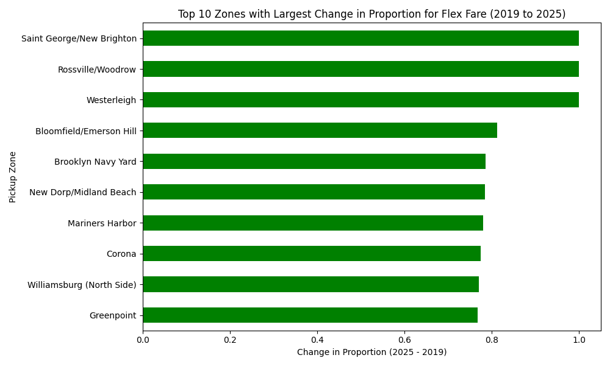
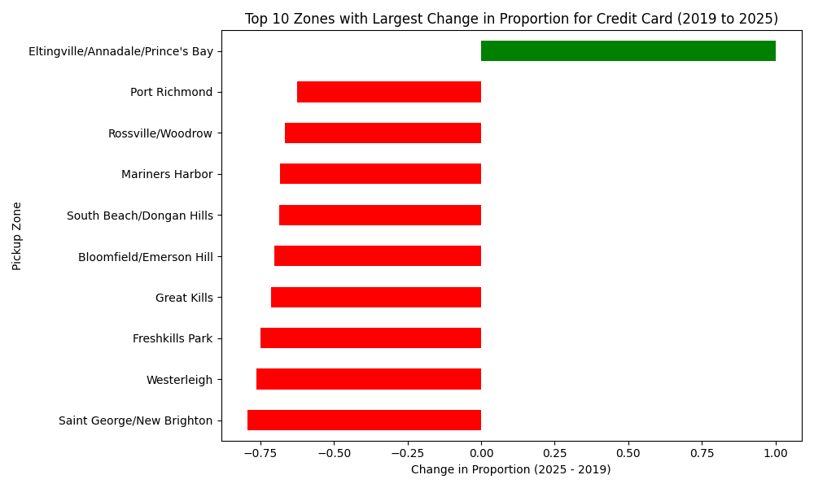
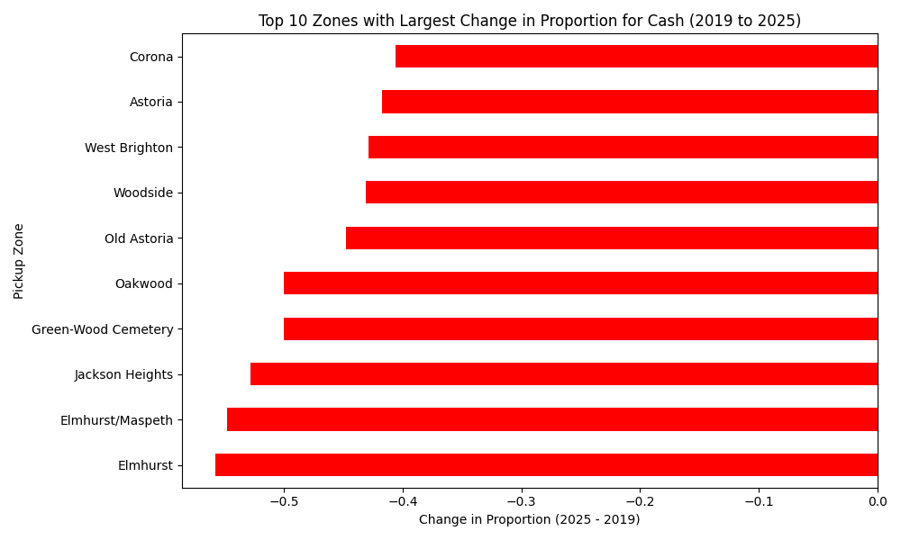
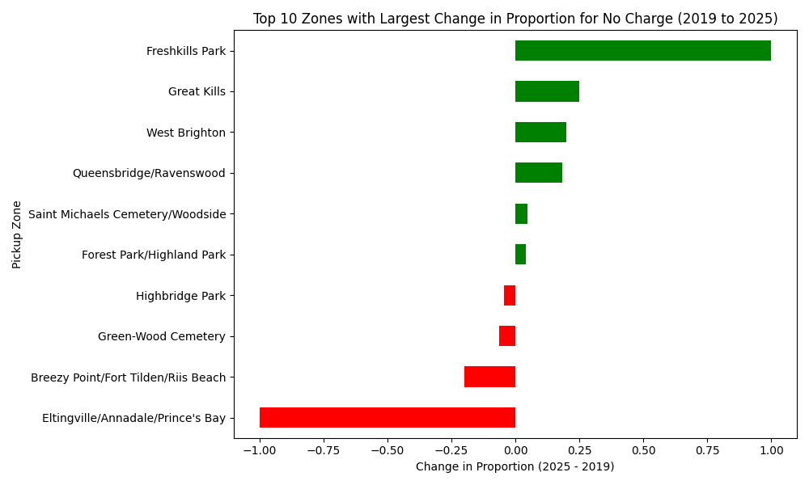
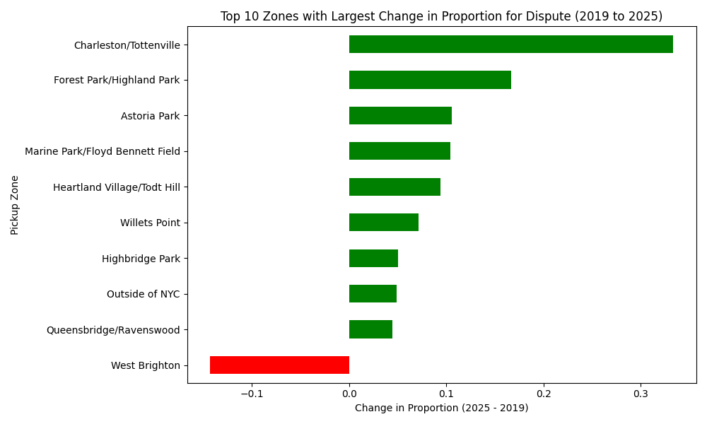

# NYC Yellow Taxi Trip Analysis

The first script in the `yellow_cab_patterns` project really got under my skin, in a good way. I couldn't stop thinking about the dataset, even waking up with it still buzzing in my head. That's usually a sign that something deeper is waiting to be uncovered. Honestly, it felt like the idea came to me in a dream, well, at least two dreams. This was the first one.

I wanted to move beyond just profiling the data and start exploring how things change over time. That shift opened up a whole new layer of insight. What better lens than payment behavior across different zones? It gave me a way to track evolving consumer habits and urban mobility patterns. And by pulling in the zone lookup file, I could finally give names to those mysterious location IDs, turning raw data into something more human and relatable.

It felt like raising the bar: not just crunching numbers, but telling a story about how people move, pay, and live in the city. And that's when things started to get really interesting.

---

**What It Does:**

- Compares payment type distributions between 2019 and 2025.
- Analyzes average tip amounts by payment method and year.
- Identifies neighborhoods with the most dramatic shifts.
- Visualizes changes in payment behavior across NYC zones.

---

**Files of Interest:**

- `compare_payment_location.py` – The script that performed the analysis.
- `output_change_in_proportions/` – Directory containing the generated plots and summaries.

---

**Data Source:**

Trip data from the [NYC Taxi & Limousine Commission](https://www.nyc.gov/site/tlc/about/tlc-trip-record-data.page).
- **Yellow Taxi Trip Records – January 2019 (PARQUET)**
- **Yellow Taxi Trip Records – January 2025 (PARQUET)**
- **Taxi Zone Lookup Table (CSV)**

---

**Data Summary:**

### Payment Type Distribution by Year
| Year | Flex Fare | Credit Card | Cash | No Charge | Dispute |
|:---:|:---:|:---:|:---:|:---:|:---:|
| 2019 | 0.37% | 71.41% | 27.74% | 0.37% | 0.11% |
| 2025 | 13.68% | 73.42% | 11.28% | 0.46% | 1.17% |

### Average Tip Amount
| Year | Flex Fare | Credit Card | Cash | No Charge | Dispute |
|:---:|:---:|:---:|:---:|:---:|:---:|
| 2019 | $0.01 | $2.55 | $0.00 | $0.00 | $0.00 |
| 2025 | $0.54 | $4.11 | $0.00 | $0.01 | $0.01 |

---

**Payment Type Shifts by Category:**

Visualizing how each payment method evolved between 2019 and 2025 across NYC neighborhoods.

### Flex Fare
A quiet revolution. From fringe to a significant feature.

---

### Credit Card
Still dominant, but not untouched. Some zones saw dramatic swings.

---

### Cash
The decline of the tangible. A farewell to folded bills.

---

### No Charge
Free rides—or accounting ghosts? A curious uptick.

---

### Dispute
When the meter runs and the argument begins.

---

## Why It Exists

It exists because one dataset led to another question, and then another. While working on a different script, I stumbled into something that wouldn't let go. I kept wondering: *What's really changing in the way people move through the city?* That curiosity turned into a chase, and this script became the first step in trying to answer it. It's what happens when data stops being just numbers and starts whispering stories.

---

## What's Next?

There's another dream waiting. The first one was about payment behavior, how people pay, where they pay, and how that's shifting. The next might be about *when* they travel, *how far*, or *how long*. Maybe it's about tipping culture, or maybe it's something I haven't seen yet. But the questions are there, and the data's still talking. Time to listen again.

I don't know why, but every time I write *maybe*, Dignam from *The Departed* haunts me. That voice, that edge, it's like he's daring me to stop guessing and start digging. So yeah, maybe it's time to find out.
